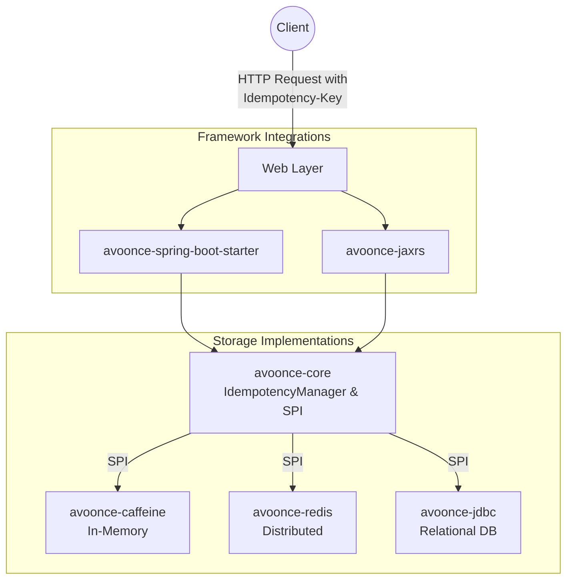

# AvoOnce - Distributed Idempotency Starter

AvoOnce is a robust, framework-agnostic, open-source library that solves the "exactly-once" processing myth in distributed systems. It prevents duplicate processing (e.g., double-charging) during network retries by caching responses and enforcing a strict state machine based on an `Idempotency-Key`.

## Features
*   **Infrastructure Independent (Pluggable):** Provide an agnostic SPI (Service Provider Interface) so teams can bring their own storage (Caffeine, Redis, JDBC).
*   **Framework Agnostic Core:** The core logic is completely independent of web frameworks.
*   **Standards Compliant:** Aligns with the IETF `Idempotency-Key` HTTP header draft.

## Modules
*   **`avoonce-core`**: Pure Java core containing the state machine and SPI.
*   **`avoonce-caffeine`**: Safe-by-default in-memory implementation using Caffeine.
*   **`avoonce-redis`**: Distributed implementation using Redis.
*   **`avoonce-jdbc`**: Relational database implementation using SQL Unique Constraints.
*   **`avoonce-spring-boot-starter`**: Spring Web MVC integration.
*   **`avoonce-jaxrs`**: Dropwizard / Jersey integration.

## Architecture
To support multiple frameworks and backends seamlessly, the project is split into a maven multi-module build.

