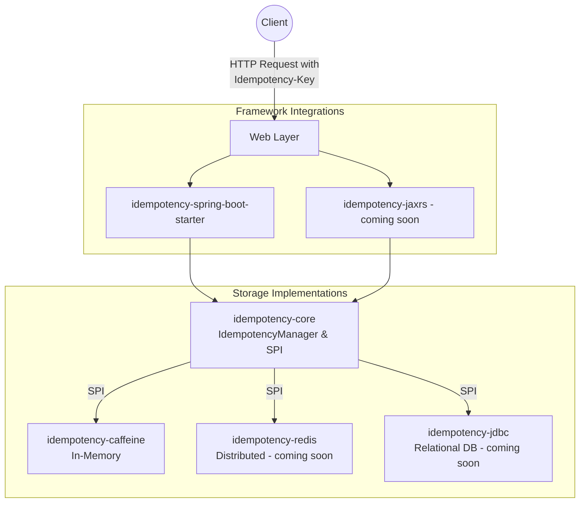

# AvoOnce - Distributed Idempotency Starter

[](https://adoptium.net/)
[](https://spring.io/projects/spring-boot)
[](https://opensource.org/licenses/MIT)

[]

AvoOnce is a robust, framework-agnostic, open-source library that solves the "exactly-once" processing myth in distributed systems. It prevents duplicate processing (e.g., double-charging) during network retries by caching responses and enforcing a strict state machine based on an `Idempotency-Key`.

## Features
*   **Zero-Code Integration:** Automatically intercepts requests and handles idempotency without requiring changes to your controllers or business logic.
*   **Infrastructure Independent (Pluggable):** Provides an agnostic SPI (Service Provider Interface) so teams can bring their own storage (Caffeine, Redis, JDBC).
*   **Framework Agnostic Core:** The core state machine logic is completely independent of web frameworks.
*   **Payload Validation:** Optionally hashes request bodies to prevent clients from reusing an idempotency key with different payloads.
*   **Standards Compliant:** Aligns with the IETF `Idempotency-Key` HTTP header draft.

---

## Quick Start (Spring Boot)

AvoOnce is incredibly easy to add to a Spring Boot application. Because it operates at the HTTP Filter layer, you do not need to change any of your existing `@RestController` code. Read more about it [here](idempotency-spring-boot-starter/README.md).

### 1. Add Dependencies
Add the Spring Boot starter and your chosen storage backend (e.g., Caffeine for in-memory) to your `pom.xml`:

```xml
<dependency>
    <groupId>com.raghavocode.avoonce</groupId>
    <artifactId>idempotency-spring-boot-starter</artifactId>
    <version>1.0.0</version>
</dependency>

<!-- Choose a storage backend -->
<!-- For in-memory storage (single-node) -->
<dependency>
    <groupId>com.raghavocode.avoonce</groupId>
    <artifactId>idempotency-caffeine</artifactId>
    <version>1.0.0</version>
</dependency>
<!-- For distributed Redis storage (coming soon) -->
<!--
<dependency>
    <groupId>com.raghavocode.avoonce</groupId>
    <artifactId>idempotency-redis</artifactId>
    <version>1.0.0</version>
</dependency>
-->
<!-- For relational database storage (coming soon) -->
<!--
<dependency>
    <groupId>com.raghavocode.avoonce</groupId>
    <artifactId>idempotency-jdbc</artifactId>
    <version>1.0.0</version>
</dependency>
-->
```

### 2. Send Requests
That's it! Your application now supports idempotency. Clients just need to include the `Idempotency-Key` header in their HTTP requests:

```bash
curl -X POST http://localhost:8080/api/payments \
  -H "Idempotency-Key: f4b3b3b3-3b3b-3b3b-3b3b-3b3b3b3b3b3b" \
  -H "Content-Type: application/json" \
  -d '{"amount": 100.00, "accountId": "acc-123"}'
```

If the client sends the exact same request again with the same `Idempotency-Key`, AvoOnce will intercept it, bypass your controller, and instantly return the previously cached HTTP response.

---

## Modules
*  [**`idempotency-core`**](idempotency-core/README.md): Pure Java core containing the state machine, request hashing logic, and SPI.
*  [**`idempotency-caffeine`**](idempotency-caffeine/README.md): Safe-by-default in-memory implementation using Caffeine. Perfect for single-node deployments.
*  [**`idempotency-spring-boot-starter`**](idempotency-spring-boot-starter/README.md): Spring Web MVC integration (Servlet Filter). Auto-configures everything.
* [**`idempotency-jaxrs`**](idempotency-jaxrs/README.md): JAX-RS integration (coming soon).
* [**`idempotency-redis`**](idempotency-redis/README.md): Distributed Redis implementation (coming soon).
* [**`idempotency-jdbc`**](idempotency-jdbc/README.md): Relational Database implementation (coming soon).

## Architecture
To support multiple frameworks and backends seamlessly, the project is split into a maven multi-module build.



## LICENSE

This project is licensed under the MIT License.

