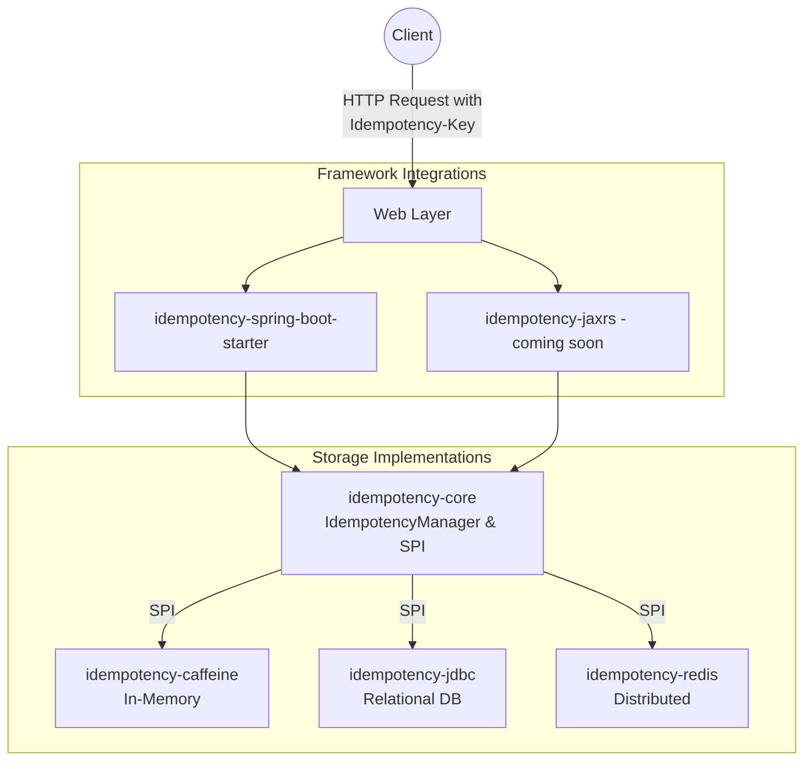

# AvoOnce - Distributed Idempotency Starter

[](https://adoptium.net/)
[](https://spring.io/projects/spring-boot)
[](https://opensource.org/licenses/MIT)
[](https://github.com/ravocode/AvoOnce/actions/workflows/maven.yml)


AvoOnce is a robust, framework-agnostic, open-source library that solves the "exactly-once" processing myth in distributed systems. It prevents duplicate processing (e.g., double-charging) during network retries by caching responses and enforcing a strict state machine based on an `Idempotency-Key`.

## Features
*   **Zero-Code Integration:** Automatically intercepts requests and handles idempotency without requiring changes to your controllers or business logic.
*   **Infrastructure Independent (Pluggable):** Provides an agnostic SPI (Service Provider Interface) so teams can bring their own storage (Caffeine, Redis, JDBC).
*   **Framework Agnostic Core:** The core state machine logic is completely independent of web frameworks.
*   **Payload Validation:** Optionally hashes request bodies to prevent clients from reusing an idempotency key with different payloads.
*   **Standards Compliant:** Aligns with the IETF `Idempotency-Key` HTTP header draft.

## Why AvoOnce? (The Gaps It Fills)
Handling idempotency in distributed systems is notoriously difficult. AvoOnce fills several critical gaps in the Java ecosystem:
*   **True Idempotency vs. Locks:** Distributed locks (like ShedLock or Redis lock) prevent concurrent execution, but they *don't cache HTTP responses*. If a network drops a successful `200 OK` response, a lock will treat a client's retry as a duplicate and fail. AvoOnce caches and replays the exact raw HTTP bytes, perfectly solving the dropped response problem.
*   **The Boilerplate Gap:** Writing manual lock/cache logic inside every `@RestController` is tedious and error-prone. AvoOnce's *Zero-Code Integration* operates entirely at the Servlet Filter layer, protecting hundreds of endpoints instantly without changing business logic.
*   **Payload Tampering:** Naïve solutions often replay responses based purely on the `Idempotency-Key`. AvoOnce hashes the request body (SHA-256) to ensure malicious clients can't reuse keys with mutated payloads (e.g., changing payment amounts).
*   **Framework Lock-In:** AvoOnce's core state machine and pluggable storage engines are 100% framework-agnostic, avoiding heavy ecosystem lock-in (like Spring Integration's Idempotent Receiver) while still providing a seamless Spring Boot auto-configuration.

---

## Quick Start (Spring Boot)

AvoOnce is incredibly easy to add to a Spring Boot application. Because it operates at the HTTP Filter layer, you do not need to change any of your existing `@RestController` code.

Read more about it [here](idempotency-spring-boot-starter/README.md) and refer the [sample application](idempotency-spring-boot-sample/) for more details.


### 1. Configure GitHub Packages & Add Dependencies

> [!WARNING]
> **GitHub Packages Authentication Required**
> AvoOnce is currently hosted on GitHub Packages, which requires authentication.
> Before adding the dependencies, you must:
> 1. Generate a [GitHub Personal Access Token](https://github.com/settings/tokens) with `read:packages` scope.
> 2. Add the token to your `~/.m2/settings.xml`:
>    ```xml
>    <servers>
>      <server>
>        <id>github</id>
>        <username>YOUR_GITHUB_USERNAME</username>
>        <password>YOUR_PAT</password>
>      </server>
>    </servers>
>    ```
> 3. Add the repository to your `pom.xml`:
>    ```xml
>    <repositories>
>      <repository>
>        <id>github</id>
>        <url>https://maven.pkg.github.com/ravocode/AvoOnce</url>
>      </repository>
>    </repositories>
>    ```

Add the Spring Boot starter and your chosen storage backend (e.g., Caffeine for in-memory) to your `pom.xml`:

```xml
<dependency>
    <groupId>io.github.ravocode.avoonce</groupId>
    <artifactId>idempotency-spring-boot-starter</artifactId>
    <version>1.0.0-alpha.3.0</version>
</dependency>

<!-- Choose a storage backend -->
<!-- For in-memory storage (single-node) -->
<dependency>
    <groupId>io.github.ravocode.avoonce</groupId>
    <artifactId>idempotency-caffeine</artifactId>
    <version>1.0.0-alpha.3.0</version>
</dependency>
<!-- OR -->
<!-- For relational database storage-->
<dependency>
    <groupId>io.github.ravocode.avoonce</groupId>
    <artifactId>idempotency-jdbc</artifactId>
    <version>1.0.0-alpha.3.0</version>
</dependency>
<!-- OR -->
<!-- For distributed Redis storage -->
<dependency>
    <groupId>io.github.ravocode.avoonce</groupId>
    <artifactId>idempotency-redis</artifactId>
    <version>1.0.0-alpha.3.0</version>
</dependency>
```

### 2. Send Requests
That's it! Your application now supports idempotency. Clients just need to include the `Idempotency-Key` header in their HTTP requests:

```bash
curl -X POST http://localhost:8080/api/payments \
  -H "Idempotency-Key: f4b3b3b3-3b3b-3b3b-3b3b-3b3b3b3b3b3b" \
  -H "Content-Type: application/json" \
  -d '{"amount": 100.00, "accountId": "acc-123"}'
```

If the client sends the exact same request again with the same `Idempotency-Key`, AvoOnce will intercept it, bypass your controller, and instantly return the previously cached HTTP response.

---

## Modules
*  [**`idempotency-core`**](idempotency-core/README.md): Pure Java core containing the state machine, request hashing logic, and SPI.
*  [**`idempotency-caffeine`**](idempotency-caffeine/README.md): Safe-by-default in-memory implementation using Caffeine. Perfect for single-node deployments.
*  [**`idempotency-spring-boot-starter`**](idempotency-spring-boot-starter/README.md): Spring Web MVC integration (Servlet Filter). Auto-configures everything.
* [**`idempotency-jdbc`**](idempotency-jdbc/README.md): Relational Database implementation.
* [**`idempotency-jaxrs`**](idempotency-jaxrs/README.md): JAX-RS integration (coming soon).
* [**`idempotency-redis`**](idempotency-redis/README.md): Distributed Redis implementation.

## Architecture
To support multiple frameworks and backends seamlessly, the project is split into a maven multi-module build.



## LICENSE

This project is licensed under the MIT License.

