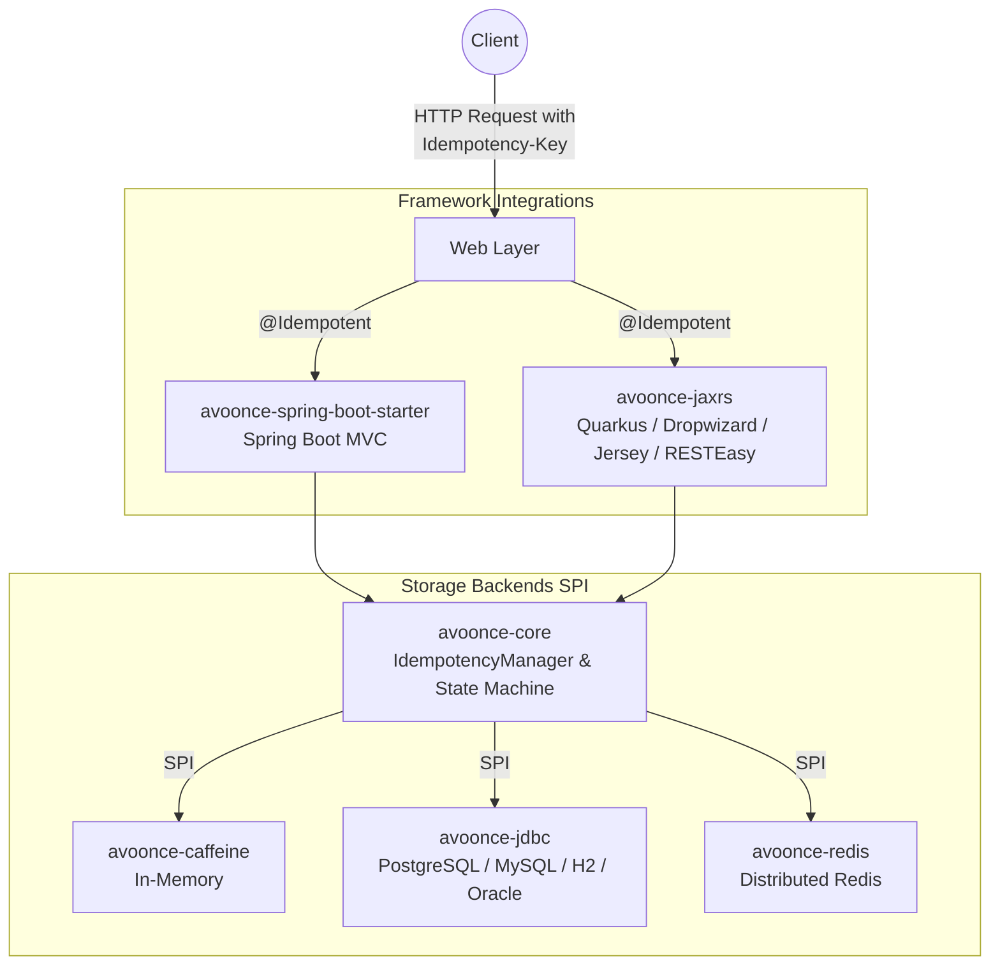

# AvoOnce - Distributed Idempotency handler for Java REST APIs

[](https://adoptium.net/)
[](https://spring.io/projects/spring-boot)
[](https://jakarta.ee/)
[](https://quarkus.io/)
[](https://www.dropwizard.io/)
[](https://opensource.org/licenses/MIT)
[](https://github.com/ravocode/AvoOnce/actions/workflows/maven.yml)


AvoOnce is a lightweight, framework-agnostic distributed idempotency library for Java. It solves the "exactly-once" execution challenge across distributed services and microservices by enforcing a strict state machine, in-flight concurrent execution locking, payload tamper protection, and byte-perfect HTTP response caching based on the IETF `Idempotency-Key` specification.

---

## Key Features

*   **Selective `@Idempotent` Protection:** Explicit, annotation-driven protection on your endpoints (`@Idempotent`). Unannotated endpoints (e.g. health checks, metrics, reads) bypass the filter completely with zero overhead.
*   **Multi-Framework Support:** First-class integrations for **Spring Boot 4.0+** (Servlet Filter via `OncePerRequestFilter`), **Quarkus 3.12+**, **Dropwizard 4.0+**, and any **Jakarta EE 10 / JAX-RS 3.1+** framework (Jersey 3+, RESTEasy 6+ via `@NameBinding` `ContainerRequestFilter`).
*   **Byte-Perfect HTTP Caching & Replay:** Captures exact status codes, headers, and raw response bytes, replaying responses without invoking business logic or database queries.
*   **In-Flight Concurrency Locking:** Prevents concurrent duplicate requests from double-executing. Simultaneous in-flight requests with the same key receive an immediate `409 Conflict`.
*   **Payload Tamper Protection:** Computes a cryptographic SHA-256 hash of the request body to detect and reject modified payloads reusing an existing key (`422 Unprocessable Entity`).
*   **Fault-Tolerant Retry Handling:** Server errors (`5xx`) automatically transition the idempotency record to `FAILED`, allowing clients to safely retry after transient failures.
*   **Pluggable Storage Backends (SPI):** Clean Service Provider Interface with built-in production backends:
    *   **Caffeine:** Ultra-fast, single-node in-memory store.
    *   **JDBC:** Distributed store supporting PostgreSQL, MySQL, H2, Oracle, MariaDB, and SQL Server with automatic table creation (`auto-ddl`) and scheduled background eviction.
    *   **Redis:** High-throughput distributed store with native TTL expiration.
*   **Standards-Compliant:** Conforms to the IETF `Idempotency-Key` HTTP Header draft specification.

---

## Architecture


```mermaid
graph TD
    Client((Client)) -->|"HTTP Request with<br/>Idempotency-Key"| Web[Web Layer]
    
    subgraph Framework Integrations
        Web -->|"@Idempotent"| SB[avoonce-spring-boot-starter<br/>Spring Boot MVC]
        Web -->|"@Idempotent"| JAX[avoonce-jaxrs<br/>Quarkus / Dropwizard / Jersey / RESTEasy]
    end
    
    SB --> Core[avoonce-core<br/>IdempotencyManager & State Machine]
    JAX --> Core
    
    subgraph Storage Backends SPI
        Core -->|SPI| Caff[avoonce-caffeine<br/>In-Memory]
        Core -->|SPI| JDBC[avoonce-jdbc<br/>PostgreSQL / MySQL / H2 / Oracle]
        Core -->|SPI| Red[avoonce-redis<br/>Distributed Redis]
    end
```

---
### 📦 How to Get It

AvoOnce is published to **Maven Central**. You do not need to configure any custom repositories in your build system. Simply add the relevant dependencies to your project as shown in the Quick Start sections below.


## Quick Start: Spring Boot 4

### 1. Add Dependencies

```xml
<!-- Spring Boot Starter -->
<dependency>
    <groupId>io.github.ravocode</groupId>
    <artifactId>avoonce-spring-boot-starter</artifactId>
    <version>1.0.0</version>
</dependency>

<!-- Choose a Storage Backend -->
<!-- Option A: In-Memory (Caffeine) -->
<dependency>
    <groupId>io.github.ravocode</groupId>
    <artifactId>avoonce-caffeine</artifactId>
    <version>1.0.0</version>
</dependency>

<!-- Option B: Relational DB (JDBC) -->
<dependency>
    <groupId>io.github.ravocode</groupId>
    <artifactId>avoonce-jdbc</artifactId>
    <version>1.0.0</version>
</dependency>

<!-- Option C: Distributed Redis -->
<dependency>
    <groupId>io.github.ravocode</groupId>
    <artifactId>avoonce-redis</artifactId>
    <version>1.0.0</version>
</dependency>
```

### 2. Annotate Your Endpoints

Annotate the target controller method or class with `@Idempotent`:

```java
import io.github.ravocode.avoonce.spring.annotation.Idempotent;
import org.springframework.http.ResponseEntity;
import org.springframework.web.bind.annotation.*;

@RestController
@RequestMapping("/api/payments")
public class PaymentController {

    @PostMapping
    @Idempotent // Protected by AvoOnce
    public ResponseEntity<PaymentResponse> createPayment(@RequestBody PaymentRequest req) {
        PaymentResponse response = paymentService.process(req);
        return ResponseEntity.status(201).body(response);
    }

    @PostMapping("/unprotected")
    // Unannotated: bypasses idempotency filter even if Idempotency-Key is sent
    public ResponseEntity<PaymentResponse> unprotected(@RequestBody PaymentRequest req) {
        return ResponseEntity.ok(paymentService.process(req));
    }
}
```

### 3. Send Requests

Include the `Idempotency-Key` header in client requests:

```bash
curl -i -X POST http://localhost:8080/api/payments \
  -H "Idempotency-Key: a1b2c3d4-e5f6-7890-abcd-ef1234567890" \
  -H "Content-Type: application/json" \
  -d '{"amount": 99.99, "accountId": "acc-456"}'
```

If the client retries with the same key, AvoOnce intercepts the call, bypasses the controller, and replays the cached HTTP response instantly!

---

## Quick Start: Quarkus, Dropwizard & Jakarta EE (JAX-RS)

### 1. Add Dependencies

```xml
<dependency>
    <groupId>io.github.ravocode</groupId>
    <artifactId>avoonce-jaxrs</artifactId>
    <version>1.0.0</version>
</dependency>
<dependency>
    <groupId>io.github.ravocode</groupId>
    <artifactId>avoonce-caffeine</artifactId>
    <version>1.0.0</version>
</dependency>
```

### 2. Register Filter

#### In Quarkus (CDI):
```java
@ApplicationScoped
public class IdempotencyProducer {
    @Produces
    @Singleton
    public IdempotencyRepository idempotencyRepository() {
        return new CaffeineIdempotencyRepository(new IdempotencyConfig());
    }
}
```

#### In Dropwizard 4+ (`Application.run`):
```java
@Override
public void run(MyConfiguration config, Environment environment) {
    IdempotencyRepository repository = new CaffeineIdempotencyRepository(new IdempotencyConfig());
    environment.jersey().register(new IdempotencyContainerFilter(repository));
}
```

### 3. Annotate Resources

```java
import io.github.ravocode.avoonce.jaxrs.Idempotent;
import jakarta.ws.rs.*;
import jakarta.ws.rs.core.Response;

@Path("/api/payments")
public class PaymentResource {

    @POST
    @Idempotent // Name-bound JAX-RS filter protection
    @Consumes("application/json")
    @Produces("application/json")
    public Response processPayment(PaymentRequest request) {
        return Response.status(201).entity(paymentService.process(request)).build();
    }
}
```

---

## Configuration Reference

Customize starter properties in `application.yml` or `application.properties`:

```yaml
avoonce:
  idempotency:
    # Storage engine: "auto", "caffeine", "jdbc", or "redis"
    store: "auto"

    # HTTP header name
    header-name: "Idempotency-Key"

    # Time-To-Live for cached responses
    ttl: 1
    ttl-unit: HOURS

    # Lock timeout for active requests in progress
    lock-timeout: 2
    lock-timeout-unit: MINUTES

    # SHA-256 payload tampering validation
    hash-body: true

    # Reject requests to @Idempotent endpoints missing the header (HTTP 400)
    enforce: false

    # Servlet filter enablement
    filter:
      enabled: true

    # JDBC specific configuration
    jdbc:
      auto-ddl: true
      eviction:
        enabled: true
        interval-ms: 3600000
```

---

## Repository Modules

| Module | Description | Documentation |
| :--- | :--- | :--- |
| **`avoonce-core`** | Core state machine, SHA-256 hasher, response wrappers, and storage SPI | [README](avoonce-core/README.md) |
| **`avoonce-caffeine`** | Fast in-memory storage implementation backed by Caffeine | [README](avoonce-caffeine/README.md) |
| **`avoonce-jdbc`** | Distributed relational database storage (PostgreSQL, MySQL, H2, Oracle, MariaDB, SQL Server) | [README](avoonce-jdbc/README.md) |
| **`avoonce-redis`** | Distributed Redis storage with native TTL management | [README](avoonce-redis/README.md) |
| **`avoonce-spring-boot-starter`** | Spring Boot 4.0+ auto-configuration and `@Idempotent` Servlet Filter | [README](avoonce-spring-boot-starter/README.md) |
| **`avoonce-spring-boot-sample`** | Spring Boot reference application demonstrating Caffeine and JDBC backends | [README](avoonce-spring-boot-sample/README.md) |
| **`avoonce-jaxrs`** | Jakarta EE 10 / JAX-RS 3.1+ integration with `@Idempotent` name-binding | [README](avoonce-jaxrs/README.md) |
| **`avoonce-quarkus-sample`** | Quarkus 3.12 reference application demonstrating CDI integration | [README](avoonce-quarkus-sample/README.md) |
| **`avoonce-acceptance-tests`** | End-to-end acceptance test suite verifying concurrent locks, replays, and failures | Acceptance Tests |

---

## License

This project is licensed under the [MIT License](LICENSE).
