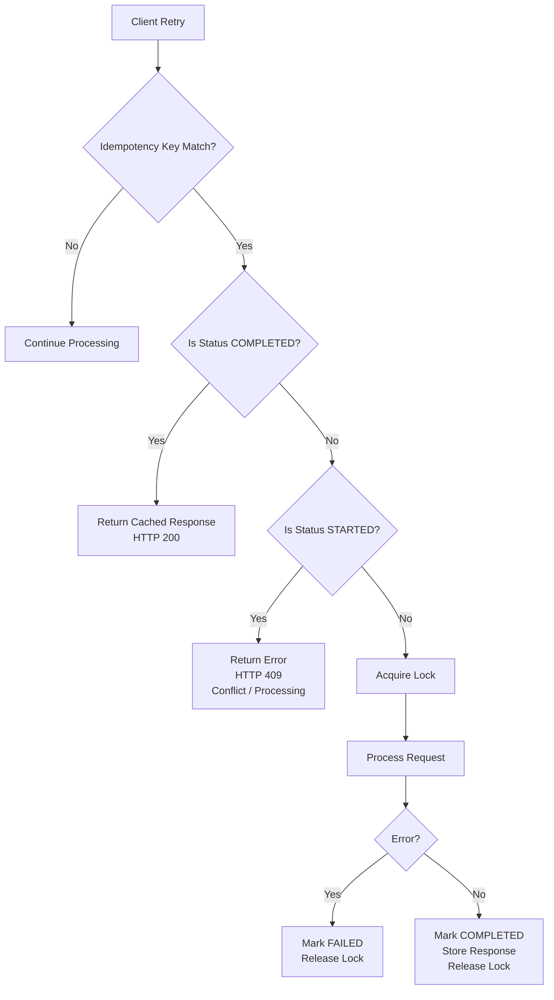

# Idempotency Core

This module contains the core domain objects and Service Provider Interface (SPI) for the AvoOnce idempotency library.

## Overview

The main goal of this module is to provide the contracts for implementing an idempotency layer in your application. The central piece is the `IdempotencyRepository` interface, which defines the operations that must be implemented by a storage provider.

## Idempotency State Machine

AvoOnce implements a strict state machine. A request cannot transition from `STARTED` -> `COMPLETED` without first acquiring a lock. If a second request arrives with the same Idempotency Key while the first is still processing (in `STARTED` state), the second request is immediately rejected (returning HTTP 409 Conflict). This ensures true "exactly-once" semantics, even in the face of concurrent retry storms.



### IdempotencyRepository

The `IdempotencyRepository` interface has the following methods:

- `acquireOrGet(String idempotencyKey)`: Atomically attempts to save a new record with the state `STARTED`. If the record already exists, it returns the existing record instead.
- `acquireOrGet(String idempotencyKey, String requestHash)`: Atomically attempts to save a new record with the state `STARTED`, verifying the request hash. If the record already exists but the request hashes do not match, an `IdempotencyMismatchException` is thrown.
- `saveSuccess(String idempotencyKey, IdempotencyResponse response)`: Updates an existing record with a successful payload and sets the state to `COMPLETED`.
- `saveFailure(String idempotencyKey, String errorMessage)`: Clears the active lock and updates the state to `FAILED`.
- `get(String idempotencyKey)`: Pure read-only check of the current record.

## Configuration

The behavior of the idempotency layer can be configured using the `IdempotencyConfig` class. This class can be configured using environment variables:

- `AVOONCE_IDEMPOTENCY_TTL`: The time-to-live for the idempotency record. Defaults to `1`.
- `AVOONCE_IDEMPOTENCY_TIMEUNIT`: The time unit for the TTL. Defaults to `HOURS`.
- `AVOONCE_IDEMPOTENCY_LOCK_TIMEOUT`: The timeout for how long a lock is held before it expires. Defaults to `2`.
- `AVOONCE_IDEMPOTENCY_LOCK_TIMEUNIT`: The time unit for the lock timeout. Defaults to `MINUTES`.

## Building

To build the module, you can run the following command from the root of the project:

```bash
mvn clean install
```
